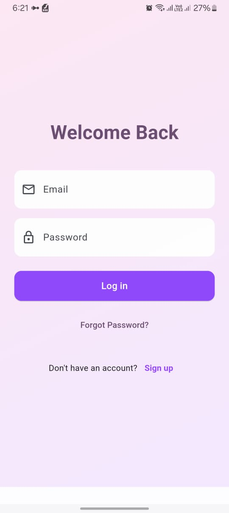
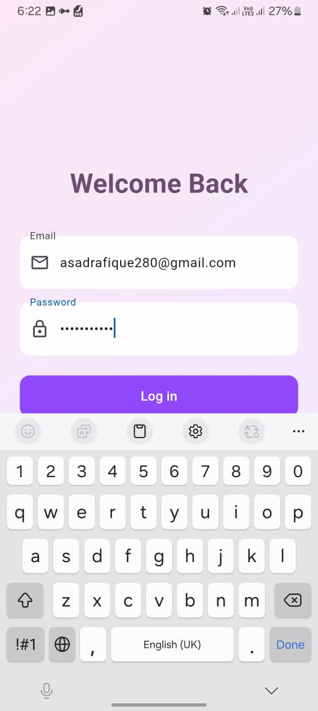
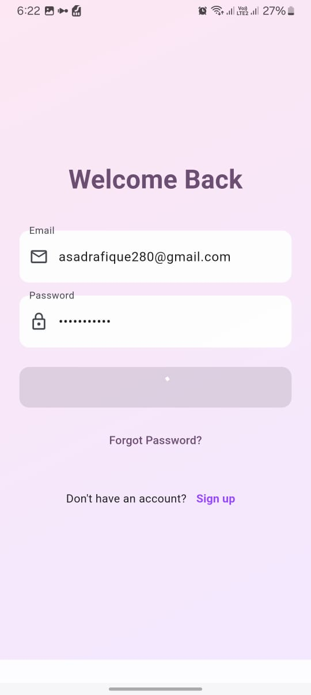
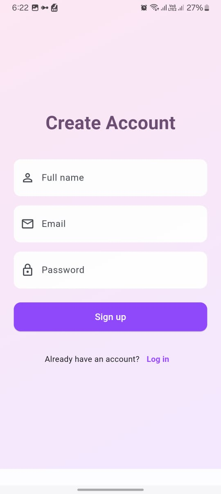
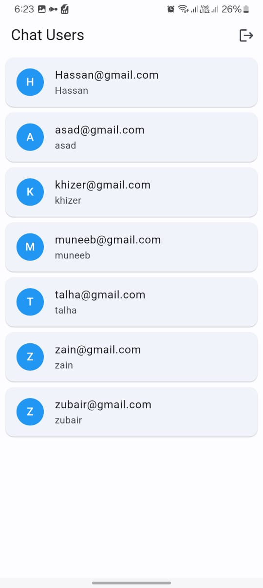
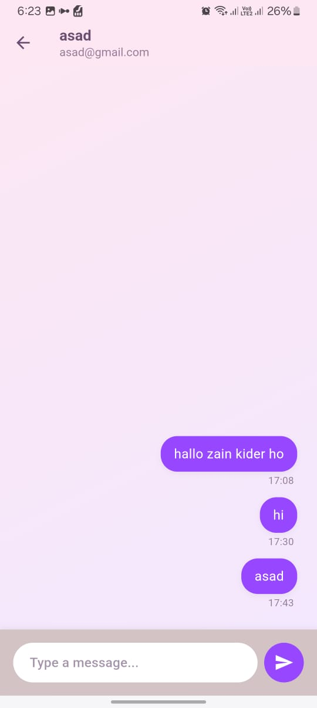
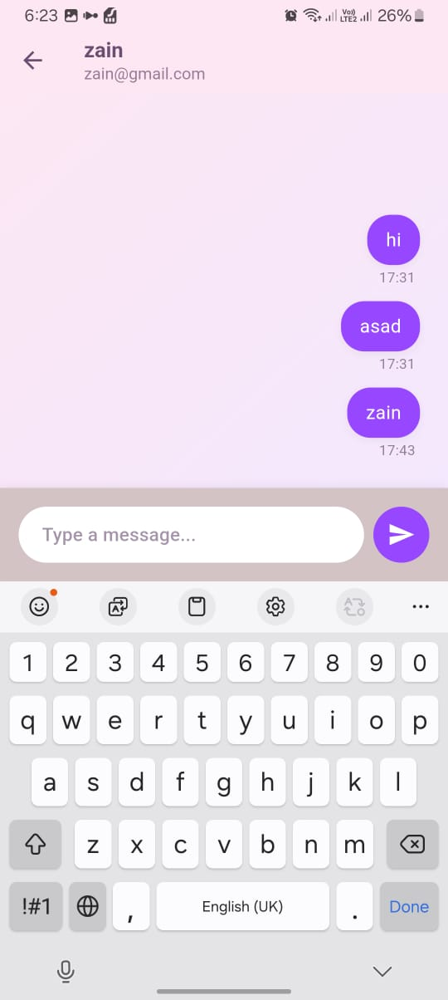

# chatting_learn

A new Flutter project.

## Getting Started

This project is a starting point for a Flutter application.

## Features

### Login and Signup with Firebase
This project integrates Firebase Authentication to provide secure user login and signup functionality. Users can create an account or log in using their email and password. Firebase ensures secure data handling and authentication.

### Chatting with Firebase
The chatting functionality is powered by Firebase Firestore. Users can send and receive messages in real time. Messages are stored securely in Firestore, allowing for seamless and synchronized communication across devices.

## Resources to Get Started

If this is your first Flutter project, here are a few resources to help you get started:

- [Lab: Write your first Flutter app](https://docs.flutter.dev/get-started/codelab)
- [Cookbook: Useful Flutter samples](https://docs.flutter.dev/cookbook)

For help getting started with Flutter development, view the [online documentation](https://docs.flutter.dev/), which offers tutorials, samples, guidance on mobile development, and a full API reference.

---

**Note:** Ensure that Firebase is properly configured in your project. This includes setting up the `google-services.json` (for Android) and `GoogleService-Info.plist` (for iOS) files in their respective platforms.
## Screenshots

### Login Screen
      

### Signup Screen

### Chat Screen
      

